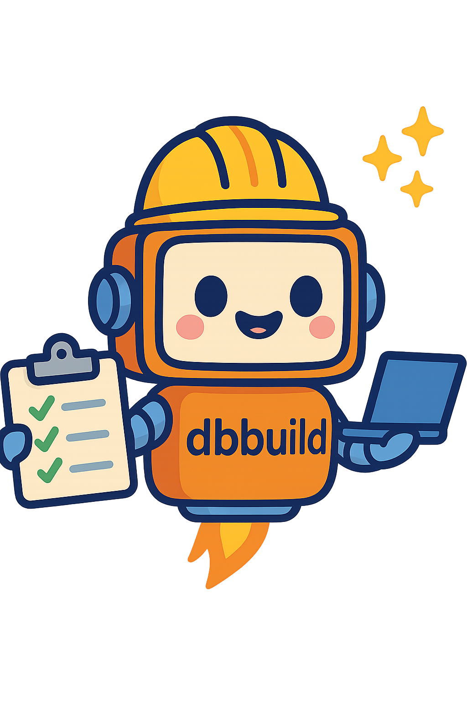

<p align="center">
  
</p>

# 🚀 dbbuild - Build & Release Automation

`dbbuild` is a sophisticated, interactive command-line tool designed to streamline and automate the entire build and release process for your software projects. It acts as a personal release assistant, guiding you from versioning to release with a series of simple prompts or running non-interactively with flags.

---

## ✨ Features

- **Interactive & Non-Interactive Modes:** Run in a fully interactive mode that prompts you for each step, or use flags (`--patch`, `--yes`, etc.) for CI/CD automation.
- **Smart Versioning:** Automatically detects the current version from `pom.xml` or a `VERSION` file and recommends a version bump (patch, minor, major) based on commit history.
- **Flexible Build System:**
    - Automatically builds Java projects using Maven if a `pom.xml` is detected.
    - Allows skipping the build step entirely for script-only or documentation repositories (`--no-build`).
    - Prompts for confirmation before running a build in interactive mode.
- **Full Git Integration:**
    - Automatically commits version file changes with a conventional commit message.
    - Creates a Git tag for the new version.
    - Pushes the commit and tags to your remote repository.
- **GitHub Integration:**
    - Prompts to authenticate with the `gh` CLI if not already logged in.
    - Offers to create a GitHub Pull Request for the new version.
    - Offers to create a GitHub Release, with the option to attach a built JAR file (`--no-jar` to disable).
- **User-Friendly Interface:** Uses a clean, colorful interface with icons to clearly communicate its progress and actions.

---

## 📋 Requirements

Before using `dbbuild`, please ensure the following tools are installed and available in your PATH:

- **`git`**: For all version control operations.
- **`gh`**: The official GitHub CLI, required for creating Pull Requests and Releases.
- **`mvn`**: Apache Maven, required for building Java-based projects with a `pom.xml`.

---

## 🛠️ Installation

To make `dbbuild` accessible from any directory on your system, move it to a directory in your system's PATH. A common location is `/usr/local/bin`.

```bash
# Make the script executable
chmod +x ./dbbuild

# Move it to a global location (requires sudo)
sudo mv ./dbbuild /usr/local/bin/dbbuild
```

After moving it, you can run the script by simply typing `dbbuild` in any project directory.

---

## ⚙️ Usage

Run the script from the root directory of your project.

### Interactive Mode

For interactive use, simply run the command without any flags:

```bash
dbbuild
```

The script will guide you through each step of the release process.

### Flags for Automation

You can use the following flags to run the script in a non-interactive or pre-configured mode:

| Flag         | Description                                    |
|--------------|------------------------------------------------|
| `--help`     | Show the help message.                         |
| `--patch`    | Automatically set the version bump to **patch**.   |
| `--minor`    | Automatically set the version bump to **minor**.   |
| `--major`    | Automatically set the version bump to **major**.   |
| `--no-build` | Skip the build step entirely.                  |
| `--no-jar`   | Do not attach a JAR to the GitHub release.     |
| `-y`, `--yes`  | Automatically answer 'yes' to all prompts.     |
